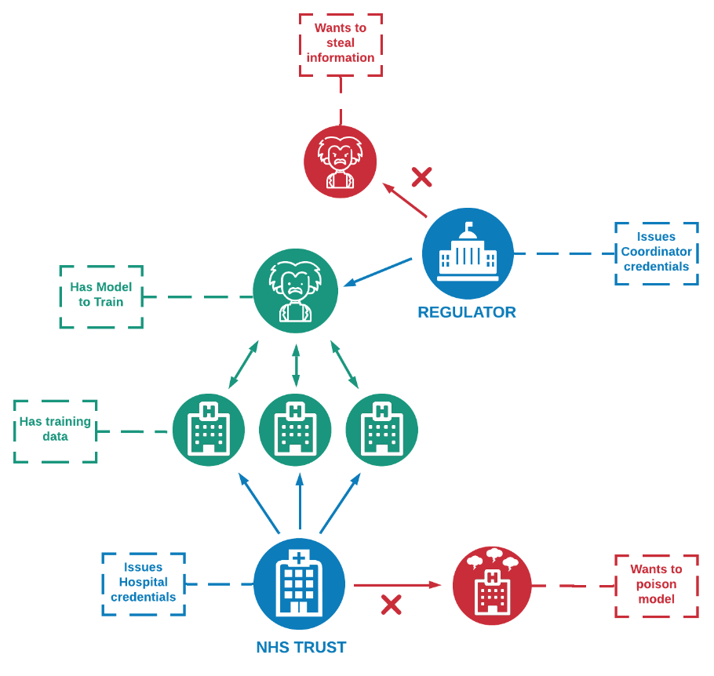
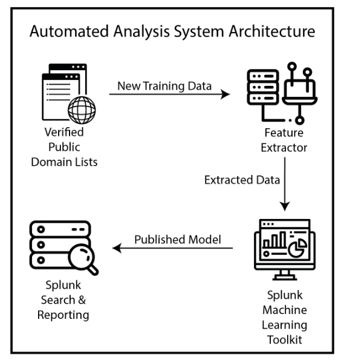

## Portfolio

---

### Publications 

[A Distributed Trust Framework for Privacy-Preserving Machine Learning](/dtf_for_ppml)
  
<!--  -->
<picture>
    <source type="images/webp" srcset="/images/Distributed_PPML.webp" />
    <source type="images/png" srcset="images/Distributed_PPML.png" />
    
</picture>

---
[Phishing URL Detection Through Top-level Domain Analysis: A Descriptive Approach](/phishing_url_detection)
  
<!--  -->
<picture>
    <source type="images/webp" srcset="/images/Phishing_Url_Detection_Splunk.webp" />
    <source type="images/png" srcset="images/Phishing_Url_Detection_Splunk.png.png" />
    
</picture>

---

### Publication Links

- [A Distributed Trust Framework for Privacy Preserving Machine Learning](https://arxiv.org/abs/2006.02456)
- [Phishing URL Detection Through Top-level Domain Analysis: A Descriptive Approach](https://arxiv.org/abs/2005.06599)

---
